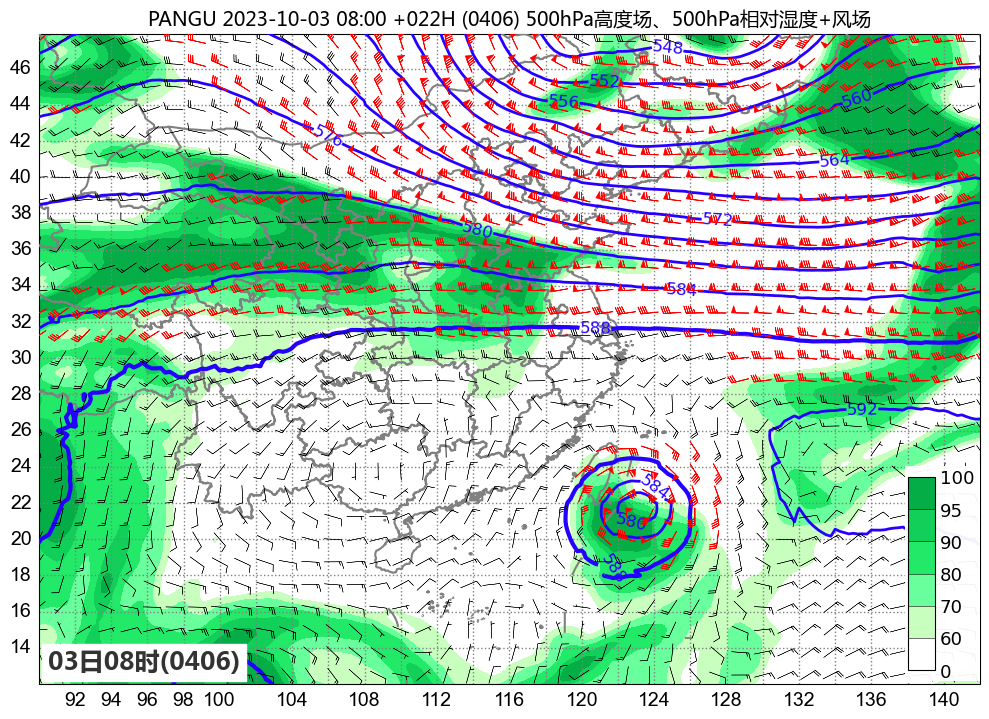
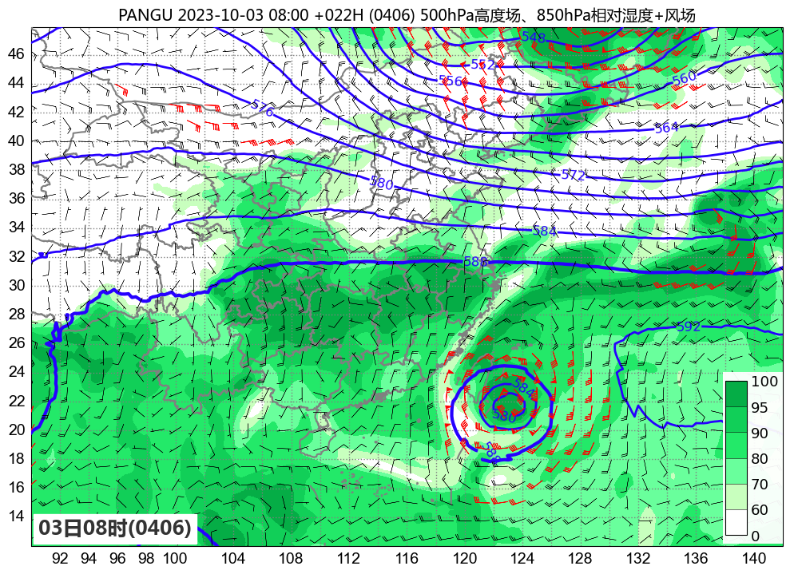
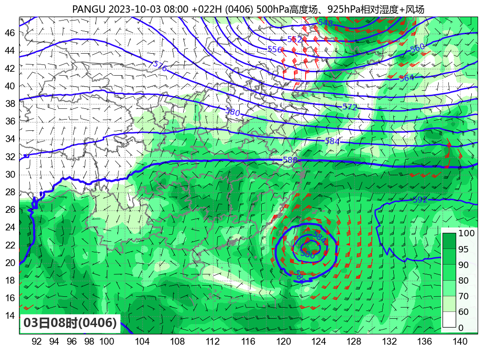
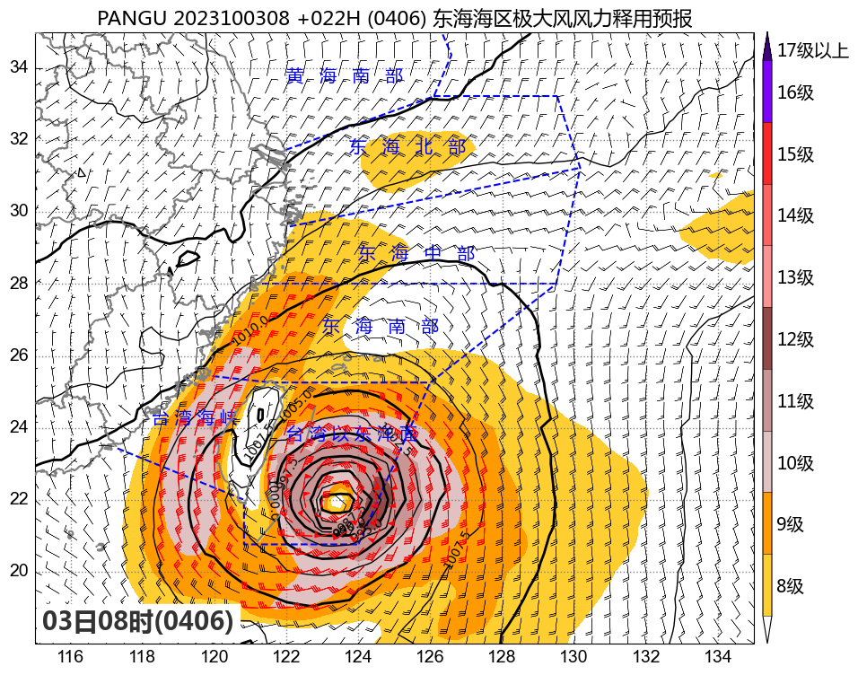
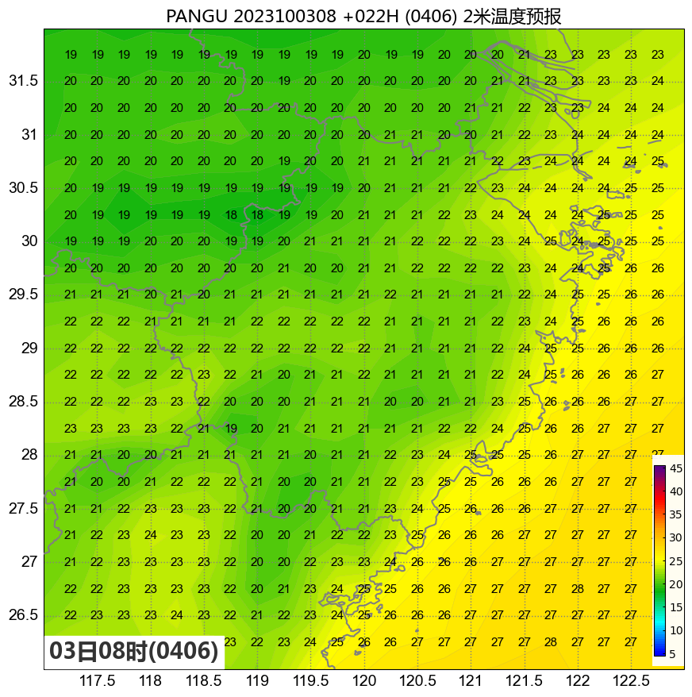

盘古气象大模型
================

华为盘古气象大模型能够以秒级时间快速生成预报结果，准确率可比肩优秀数值模式，
其在业务中的实际应用效果如何？浙江省气象台通过使用模式分析场数据，
开展了业务化运行与可视化，一方面作为数值预报的补充，另一方面通过长时间的业务运行，
实际检验分析其在天气预报业务中的应用效果。

使用了1、3、6、24小时的预训练模型，业务运行中实现了1-84小时逐小时、84-360小时逐小时迭代推理预报。

本仓库包含有业务运行与可视化的相关代码，前端使用streamlit在线展示图片。

可视化实例
^^^^^^^^^^^^^^^

天气形势
-------------

500hPa高度场+500hPa风场、相对湿度场
+++++++++++++++++++++++++++++++++++++++++++++

500hPa高度场+850hPa风场、相对湿度场
+++++++++++++++++++++++++++++++++++++++++++++

500hPa高度场+925hPa风场、相对湿度场
+++++++++++++++++++++++++++++++++++++++++++++

海平面气压场+风场+极大风风速释用场
++++++++++++++++++++++++++++++++++++++++++++

地面2米温度场
++++++++++++++++++++++++++++++++++++++++++++

站点时间高度剖面
++++++++++++++++++++++++++++++++++++++++++++

.. image:: ./docs/example_pictures/pangu.2023100308.ptsection.%E6%9D%AD%E5%B7%9E.6hourly.png